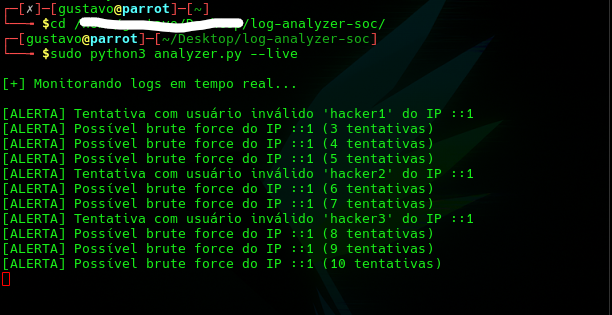

# 🔐 SOC Log Monitor (Python)

Ferramenta de análise e monitoramento de logs de autenticação SSH em ambiente Linux.

## 🚀 Funcionalidades

- Detecção de tentativas de brute force
- Identificação de usuários inválidos
- Monitoramento em tempo real (journalctl)
- Análise de arquivos de log

## 🛠️ Tecnologias

- Python
- Linux
- Regex
- Journalctl

🎯 Objetivo

Simular atividades de um analista SOC (Blue Team), identificando eventos suspeitos em logs de autenticação.

📈 Aprendizados
-Análise de logs reais
-Detecção de ataques
-Monitoramento de segurança
-Automação com Python

## 📷 Demonstração



## ▶️ Como usar

### Analisar arquivo:
```bash
python3 analyzer.py --file logs.txt

```bash
Monitorar em tempo real:
sudo python3 analyzer.py --live
📌 Exemplo de saída

```bash
[ALERTA] Possível brute force do IP ::1 (5 tentativas)
[ALERTA] Tentativa com usuário inválido 'admin' do IP 192.168.0.10
